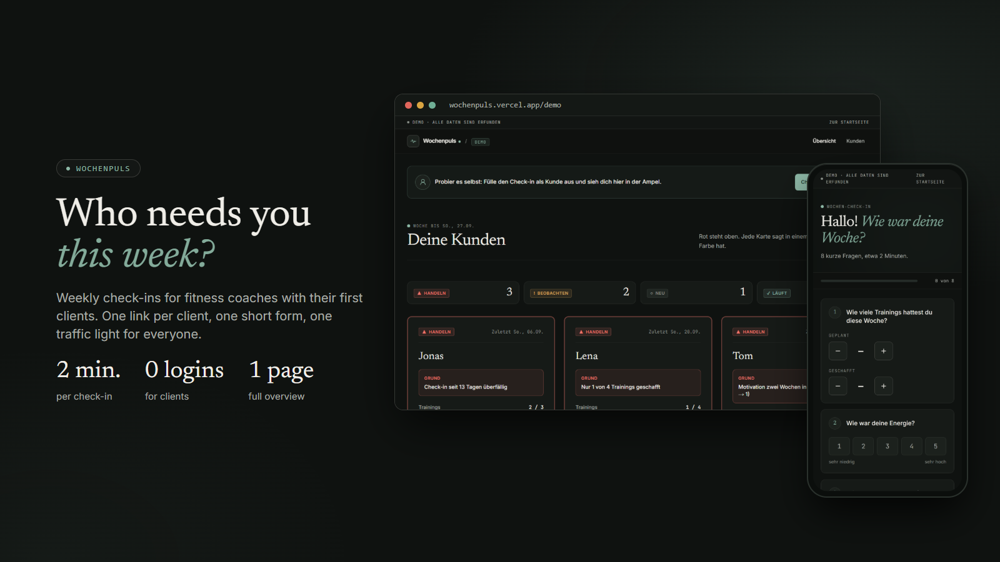
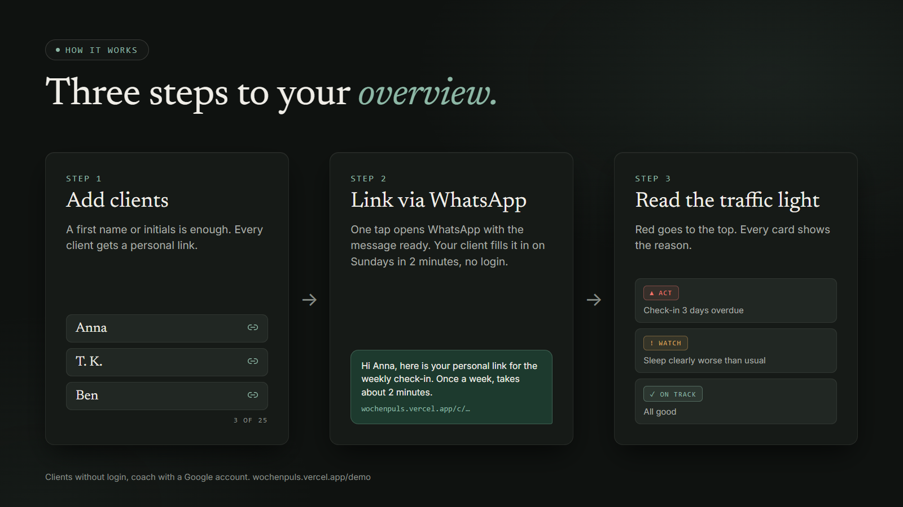
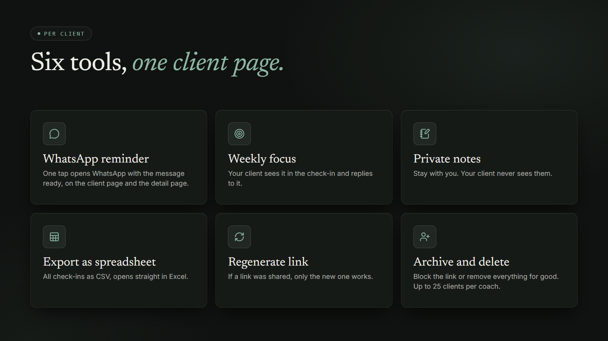
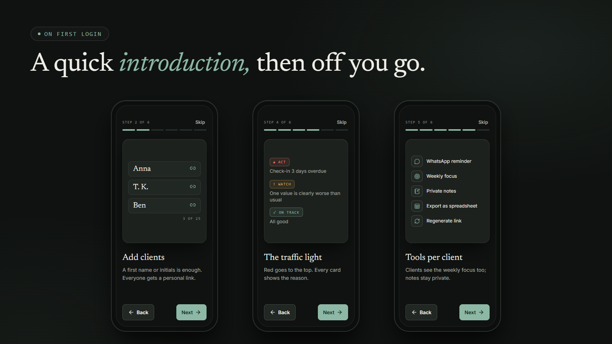

<div align="center">

[Deutsch](README.md) · **English**

# Wochenpuls

Weekly check-ins for fitness coaches with their first clients. One link per client, one short form, one traffic light for everyone.



[](https://wochenpuls.vercel.app/demo)
[](LICENSE)


[Try it out](#try-it-out) · [Tools](#tools-per-client) · [Privacy](#privacy--limits) · [Self-hosting](#self-hosting)

</div>

---

## Who is this for?

You are a fitness coach with your first clients (up to 25 are possible) and you want to know how they are really doing, without scrolling through ten WhatsApp chats every week or maintaining a spreadsheet nobody keeps up to date.

Wochenpuls collects your clients' weekly feedback in one calm place and uses a traffic light to show you who is slipping. No login for your clients, no app to install, just a personal link.

## How it works



**1. Add clients.** A first name or initials is enough. Every client gets a personal link.

**2. Link via WhatsApp.** One tap opens WhatsApp with the message ready. On Sundays, your client answers eight short questions in about two minutes: how many workouts they did, how they felt, what went well, what was hard, and whether they have a question for you.

**3. One page for everyone.** You see at a glance who is red, yellow or green, and why in one sentence. Red always comes first.

## Try it out

The demo runs with made-up clients and needs no sign-up: **[wochenpuls.vercel.app/demo](https://wochenpuls.vercel.app/demo)**

You can join in yourself: fill in the check-in like a client, then find yourself in the overview with your own traffic light. You can also click through the [introduction for new coaches](https://wochenpuls.vercel.app/demo/willkommen) there.

**Your own account:** Wochenpuls is free and a portfolio project. You sign in with Google. New coaches need an invite code, which I hand out personally. Just message me on [LinkedIn](https://www.linkedin.com/in/schmidt-frederik).

## The traffic light

Every client always has one of four traffic light colors. Wochenpuls recalculates it every time you open the overview, using fixed rules instead of gut feeling (`src/lib/ampel.ts`):

| Traffic light | Meaning | When it appears |
|---|---|---|
| 🔴 **Act** | Critical, get in touch now | The check-in is 3 days or more overdue · **or** your client completed less than half of the planned workouts · **or** energy or motivation were very low two weeks in a row (2 out of 5 or lower) |
| 🟡 **Watch** | Warning sign, keep an eye on it | The check-in is 1–2 days overdue · **or** a value is at least 2 points worse than the client's own average of the previous two to three check-ins (for stress: higher) · **or** energy, sleep or motivation are very low this week (2 out of 5 or lower) · **or** stress is very high this week (5 out of 5) |
| ⚪ **New** | Just added | The client is still waiting for their first check-in (and is not yet overdue) |
| 🟢 **On track** | Stable, no action needed | None of the above applies |

The check-in is always due on **Sundays**. If it is still missing on Monday, the traffic light turns yellow, and from Wednesday it turns red. Late check-ins are accepted up to and including Wednesday: they then count as normal for the past week. A new client does not have to check in for the first time until three days after being added at the earliest.

## What it looks like

**Your overview.** All clients on one page, sorted by urgency.


<table>
  <tr>
    <td align="center" width="50%">
      <br />
      <sub><b>The check-in on a phone.</b> Big tap targets, about two minutes.</sub>
    </td>
    <td align="center" width="50%">
      <br />
      <sub><b>A client's detail page.</b> With the history of the past weeks.</sub>
    </td>
  </tr>
</table>

The app interface is in German.

## Tools per client



- **WhatsApp reminder** – on the client page and on the detail page. WhatsApp opens with the message ready, and you pick the recipient there.
- **Weekly focus** – one sentence about what matters this week. Your client sees it in the check-in and replies to it. A new version applies from the next check-in week.
- **Private notes** – for your eyes only.
- **Export as spreadsheet** – all of a client's check-ins as CSV, opens straight in Excel.
- **Regenerate link** – in case a client link was passed on; the old link then stops working.
- **Archive and delete** – archived clients are locked, deleted ones disappear together with all their check-ins. At most 25 clients per coach.

### Introduction on first login

New coaches get a short introduction in six steps on their first login. In the demo you can find it at [/demo/willkommen](https://wochenpuls.vercel.app/demo/willkommen).



## Privacy & limits

Wochenpuls is deliberately kept slim:

- **No body or health data.** Weight, photos, nutrition or injuries are not asked for, only workouts, four ratings from 1 to 5 (energy, sleep, stress, motivation) and short texts. The form says explicitly: "Please no health information such as injuries or diagnoses." (In the app: „Bitte keine Gesundheitsangaben wie Verletzungen oder Diagnosen.“)
- **Client consent.** Before the first check-in, your client gives their consent and can withdraw it at any time.
- **Data processing agreement (DPA).** Coaches conclude it when they register: [/avv](https://wochenpuls.vercel.app/avv) (in German). You can pass the [privacy policy](https://wochenpuls.vercel.app/datenschutz) (in German) on to your clients.
- **No account for clients.** The personal link is enough.
- **No trackers.** No analytics or advertising scripts. There is exactly one cookie, the coach's session cookie after sign-in.
- **Database only from the server.** The browser never accesses the database directly.
- **Servers in Frankfurt.** Server at Vercel (region `fra1`), database at Firestore (europe-west3).
- **Every coach sees only their own clients.**
- **Delete your account yourself.** Under "Konto" (account) you delete your account together with all clients, check-ins, notes and consents.

What does not exist (yet): reminders that are sent to clients automatically, and an automatic summary of the week.

## Self-hosting

Wochenpuls is open source (MIT license), so you can set it up yourself. For a handful of clients the free plans of Vercel and Firebase are usually enough; but check their terms, for example Vercel's free plan is intended for personal, non-commercial use only. Some basic technical understanding helps.

> **Important:** The privacy policy and the data processing agreement in this repository name me as the operator. Anyone running Wochenpuls themselves needs their own legal texts.

1. **Fork the repository**: click "Fork" at the top right on GitHub.
2. **Create a Firebase project** (you can turn off Google Analytics) and create a Firestore database in it: region **europe-west3 (Frankfurt)**, "Production" mode, database ID `(default)`. The region cannot be changed later.
3. **Generate a service account key**: In the Firebase project settings under "Service accounts", click "Generate new private key". This downloads a JSON file whose entire content goes into an environment variable later. **This file is secret and must never end up on GitHub.**
4. **Set up sign-in**: In Firebase under "Authentication" → "Sign-in method", enable the **Google** provider. You add your own domain under "Settings" → "Authorized domains".
5. **Import into Vercel**: import your forked repository as a new project and set these environment variables:
   - `FIREBASE_SERVICE_ACCOUNT` – the complete content of the JSON file from step 3
   - `NEXT_PUBLIC_FIREBASE_API_KEY`, `NEXT_PUBLIC_FIREBASE_AUTH_DOMAIN`, `NEXT_PUBLIC_FIREBASE_PROJECT_ID` – from the Firebase project settings under "Your apps" → web app (the values `apiKey`, `authDomain`, `projectId`). They are not secret.
   - `ADMIN_EMAIL` – your Google address. Whoever signs in with it needs no code and can create invite codes for further coaches under "Codes".

   If you set the variables afterwards, trigger a "Redeploy" in Vercel once.
6. **Check**: open `https://your-address.vercel.app/status`. All three lines must show "✓ Ja" (yes).
7. **Get started**: sign in at `/login` with the admin address and add your first client under "Kunden" (clients).

The Node version in Vercel must match `package.json` (`engines`: 24.x). From then on, Vercel rebuilds automatically on every push.

## FAQ

**Do my clients need an app?**
No. They open their personal link in the browser, like any ordinary web page.

**What if a client forgets the check-in?**
Their traffic light automatically turns yellow and later red. If they submit it by the Wednesday after the due Sunday, it still counts for that week. With one tap you remind them via WhatsApp.

**Can several coaches use this?**
Yes. Each coach signs in with their own Google account and sees only their own clients. New coaches need an invite code the first time.

**How do I get an invite code?**
Message me on [LinkedIn](https://www.linkedin.com/in/schmidt-frederik). Wochenpuls is free.

**Is this a finished, commercial app?**
No, it is a portfolio project: small, clean and free to use.

**Where is the data stored?**
In Frankfurt: the server at Vercel (`fra1`), the database at Firestore (europe-west3).

## License

MIT, see [LICENSE](LICENSE).

Built by [Frederik Schmidt](https://github.com/fxd-gif).

---

<details>
<summary><strong>For developers</strong></summary>

### Tech stack

- [Next.js](https://nextjs.org/) 16 (App Router), React 19, TypeScript
- Tailwind CSS 4
- Firebase Authentication (Google) and Firestore, data access only server-side via the Admin SDK
- Vitest for tests
- Hosting on Vercel, region `fra1` (Frankfurt)

Traffic light rules: `src/lib/ampel.ts`. Date and week calculation (always Europe/Berlin): `src/lib/woche.ts`.

### Run locally

Requirement: Node.js 24.x.

```bash
npm install
npm run dev
```

Then open [http://localhost:3000](http://localhost:3000). For the full coach view with a database you need the environment variables from the "Self-hosting" section (`FIREBASE_SERVICE_ACCOUNT`, the three `NEXT_PUBLIC_FIREBASE_…` values and `ADMIN_EMAIL`). Locally they belong in a file called `.env.local`, which Git ignores. Without them, the demo at `/demo` still works completely.

### Tests

```bash
npm test
```

Currently 34 tests run (traffic light, week calculation, overview, CSV export, WhatsApp link).

</details>
