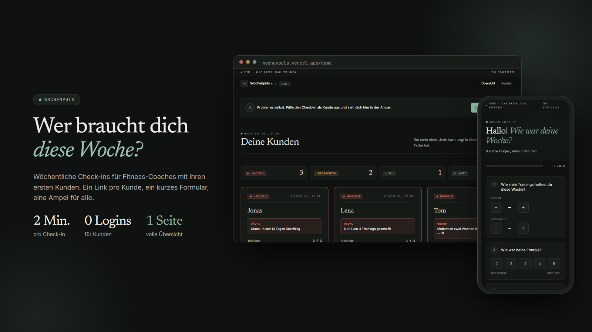
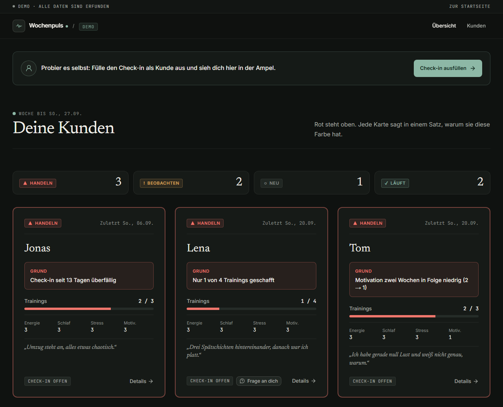
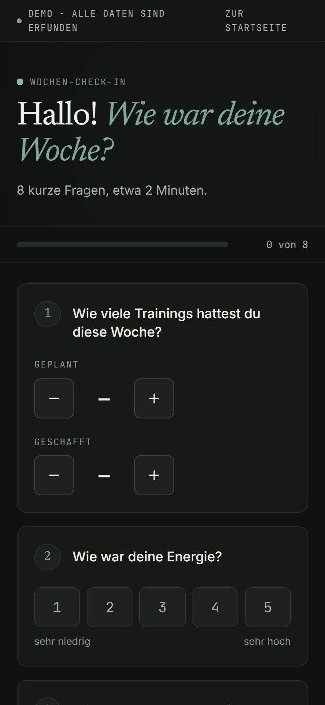
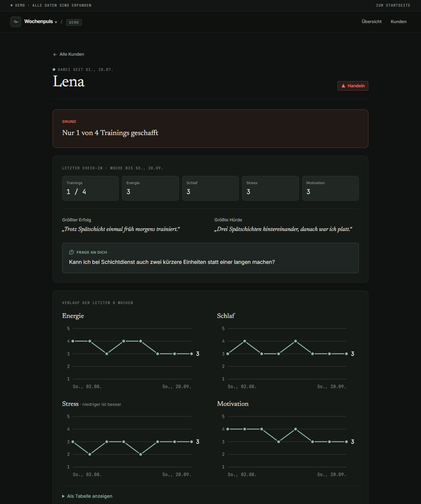

<div align="center">

# Wochenpuls

Wöchentliche Check-ins für Fitness-Coaches mit ihren ersten Kunden. Ein Link pro Kunde, ein kurzes Formular, eine Ampel für alle.



[](https://wochenpuls.vercel.app/demo)
[](LICENSE)

[In English ↓](#in-english)

</div>

---

## Für wen ist das?

Du bist Fitness-Coach, hast deine ersten ein bis zehn Kunden und willst wissen, wie es ihnen wirklich geht, ohne jede Woche zehn WhatsApp-Chats durchzuscrollen oder eine Tabelle zu pflegen, die eh keiner mehr aktuell hält.

Wochenpuls sammelt die wöchentliche Rückmeldung deiner Kunden an einem ruhigen Ort und zeigt dir mit einer Ampel, wer gerade abrutscht. Kein Login für deine Kunden, keine App zum Installieren, nur ein persönlicher Link.

## So funktioniert's

**1. Ein Link pro Kunde.** Du legst einen Kunden an und bekommst einen persönlichen Link, den du z. B. per WhatsApp verschickst. Kein Login, keine App, kein Passwort.

**2. Zwei Minuten pro Woche.** Jeden Sonntag öffnet dein Kunde seinen Link und beantwortet acht kurze Fragen: wie viele Trainings er hatte, wie es ihm ging, was gut lief, was schwer war und ob er eine Frage an dich hat.

**3. Eine Seite für alle.** Du siehst auf einen Blick, wer eine rote, gelbe oder grüne Ampel hat, und in einem Satz, warum. Rot steht immer oben.

## Die Ampel

Jeder Kunde hat immer eine von vier Ampelfarben. Wochenpuls berechnet sie bei jedem Öffnen der Übersicht neu, nach festen Regeln statt nach Bauchgefühl:

| Ampel | Bedeutung | Wann sie erscheint |
|---|---|---|
| 🔴 **Handeln** | Kritisch, jetzt melden | Der Check-in ist seit 3 Tagen oder länger überfällig · **oder** dein Kunde hat weniger als die Hälfte der geplanten Trainings geschafft · **oder** Energie oder Motivation waren zwei Wochen in Folge sehr niedrig (2 von 5 oder weniger) |
| 🟡 **Beobachten** | Warnsignal, im Blick behalten | Der Check-in ist seit 1–2 Tagen überfällig · **oder** ein Wert ist mindestens 2 Punkte schlechter als der eigene Schnitt der zwei bis drei Check-ins davor (bei Stress: höher) · **oder** Energie, Schlaf oder Motivation sind diese Woche sehr niedrig (2 von 5 oder weniger) · **oder** Stress ist diese Woche sehr hoch (5 von 5) |
| ⚪ **Neu** | Frisch angelegt | Der Kunde wartet noch auf seinen ersten Check-in |
| 🟢 **Läuft** | Stabil, kein Eingriff nötig | Keine der obigen Bedingungen trifft zu |

Fällig ist der Check-in immer **sonntags**. Fehlt er am Montag noch, springt die Ampel auf Gelb, ab Mittwoch auf Rot. Nachreichen geht bis einschließlich Mittwoch: Dann zählt der Check-in ganz normal für die vergangene Woche, und die Ampel richtet sich wieder nach seinen Antworten.

## So sieht es aus

**Deine Übersicht.** Alle Kunden auf einer Seite, sortiert nach Dringlichkeit.



**Der Check-in am Handy.** Große Tipp-Knöpfe, klare Fragen, etwa zwei Minuten.

<p align="center">
  
</p>

**Die Detailseite eines Kunden**, mit dem Verlauf der letzten Wochen als Diagramm.



## Ausprobieren

Die Demo läuft mit frei erfundenen Kunden, ganz ohne Anmeldung: **[wochenpuls.vercel.app/demo](https://wochenpuls.vercel.app/demo)**

Du kannst dort auch selbst mitmachen: Füll den Check-in aus wie ein Kunde und sieh dich direkt danach mit deiner eigenen Ampel in der Übersicht wieder.

## Datenschutz & Grenzen

Wochenpuls ist bewusst schmal gehalten:

- **Keine Körper- oder Gesundheitsangaben.** Gewicht, Fotos, Ernährung oder Verletzungen werden nicht abgefragt, nur Trainings, vier Einschätzungen von 1 bis 5 (Energie, Schlaf, Stress, Motivation) und kurze Texte. Bei den Fragen nach Erfolg und Hürde steht im Formular ausdrücklich: „Bitte keine Gesundheitsangaben wie Verletzungen oder Diagnosen.“
- **Kein Konto für Kunden.** Der persönliche Link reicht, es gibt keine Passwörter oder E-Mail-Adressen von Kunden zu verwalten.
- **Kein Tracking.** Es sind keine Analyse- oder Werbe-Skripte eingebaut.
- **Datenbank nur vom Server aus.** Der Browser hat nie direkten Zugriff auf die Datenbank, alle Zugriffe laufen über den Server.
- **Serverstandort Frankfurt.** Der Server läuft bei Vercel in Frankfurt (Region `fra1`, schon voreingestellt), die Datenbank ebenfalls, wenn du sie wie unten beschrieben in europe-west3 anlegst.
- **Ein Coach-Passwort statt vieler Konten.** Der geschützte Bereich hat genau ein Passwort; für den Alltag eines einzelnen Coaches reicht das.
- **Löschen jederzeit.** Kunden lassen sich archivieren (ihr Link ist dann gesperrt) oder endgültig löschen, samt aller Check-ins.

Was es (noch) nicht gibt: Erinnerungen an Kunden, ein „Link neu erzeugen“ bei weitergegebenen Links, ein CSV-Export oder eine automatische Zusammenfassung der Woche.

## Selbst betreiben

Wochenpuls ist Open Source (MIT-Lizenz), du kannst es dir selbst aufsetzen. Einen fertigen Dienst zum Registrieren gibt es nicht. Für ein paar Kunden reichen meist die kostenlosen Tarife von Vercel und Firebase; prüf aber deren Bedingungen, der kostenlose Tarif von Vercel ist zum Beispiel nur für private, nicht-kommerzielle Nutzung gedacht. Etwas technisches Grundverständnis hilft.

1. **Repository forken**: auf GitHub oben rechts auf „Fork“ klicken.
2. **Firebase-Projekt anlegen** (Google Analytics kannst du dabei ausschalten, es wird nicht gebraucht) und darin eine Firestore-Datenbank erstellen: Region **europe-west3 (Frankfurt)**, Modus „Produktion“, Datenbank-ID `(default)`. Die Region lässt sich später nicht mehr ändern.
3. **Dienstkonto-Schlüssel erzeugen**: In den Firebase-Projekteinstellungen unter „Dienstkonten“ auf „Neuen privaten Schlüssel generieren“ klicken. Das lädt eine JSON-Datei herunter, deren gesamter Inhalt später in eine Umgebungsvariable kommt. **Diese Datei ist geheim und darf niemals auf GitHub landen.**
4. **Bei Vercel importieren**: dein geforktes Repository als neues Projekt importieren und dabei drei Umgebungsvariablen setzen:
   - `FIREBASE_SERVICE_ACCOUNT` – der komplette Inhalt der JSON-Datei aus Schritt 3
   - `COACH_PASSWORD` – dein Passwort für den Coach-Bereich. Nimm ein langes (mindestens 12 Zeichen), denn es gibt keine Sperre nach Fehlversuchen.
   - `SESSION_SECRET` – ein zufälliger Text mit mindestens 32 Zeichen, z. B. aus einem Passwort-Generator. Damit wird dein Login-Cookie unterschrieben.

   Setzt du die Variablen erst nachträglich, lös in Vercel danach einmal „Redeploy“ aus.
5. **Prüfen**: `https://deine-adresse.vercel.app/status` öffnen. Beide Zeilen („Datenbank verbunden“ und „Coach-Login eingerichtet“) müssen „✓ Ja“ zeigen.
6. **Loslegen**: unter `/login` anmelden (oder unten auf der Startseite auf „Coach-Login“), unter „Kunden“ den ersten Kunden anlegen und ihm seinen Link schicken.

Ab dann baut Vercel bei jedem Push automatisch neu.

## FAQ

**Brauchen meine Kunden eine App?**
Nein. Sie öffnen ihren persönlichen Link im Browser, wie eine ganz normale Webseite.

**Was, wenn ein Kunde den Check-in mal vergisst?**
Dann springt seine Ampel automatisch auf Gelb und später auf Rot. Reicht er ihn bis Mittwoch nach dem fälligen Sonntag nach, zählt er trotzdem für diese Woche.

**Kann ich das für mehrere Coaches nutzen?**
Aktuell nicht. Es gibt genau ein Coach-Passwort für einen geschützten Bereich, das reicht für einen einzelnen Coach mit seinen Kunden.

**Ist das eine fertige, kommerzielle App?**
Nein, es ist ein Portfolio-Projekt: klein, sauber und frei nutzbar zum Selbst-Betreiben. Einen fertigen Dienst zum Anmelden gibt es nicht.

**Wo liegen die Daten?**
In Frankfurt, wenn du Wochenpuls wie beschrieben einrichtest: der Server bei Vercel (`fra1`), die Datenbank bei Firestore (europe-west3).

## Lizenz

MIT, siehe [LICENSE](LICENSE).

Entwickelt von [Frederik Schmidt](https://github.com/fxd-gif).

---

## In English

Wochenpuls is a small weekly check-in tool for fitness coaches who are just starting out with their first one to ten clients. Each client gets a personal link (no login, no app) and fills out an eight-question form once a week, in about two minutes. The coach sees all clients on one page with a traffic-light indicator showing who needs attention, plus a detail page with history charts.

Try the live demo with fictional clients at **[wochenpuls.vercel.app/demo](https://wochenpuls.vercel.app/demo)** — no sign-up needed, and you can fill out the check-in yourself to see it show up in the overview.

The app's interface is entirely in German, since it is built for German-speaking coaches. The project is open source under the MIT license; see the [“Selbst betreiben” (self-hosting)](#selbst-betreiben) section above for setup steps.

---

<details>
<summary><strong>Für Entwickler:innen</strong></summary>

### Tech-Stack

- [Next.js](https://nextjs.org/) 16 (App Router) + TypeScript
- Tailwind CSS v4
- Firebase Admin SDK (Firestore, nur serverseitig)
- Vitest für Tests
- Hosting auf Vercel, Region `fra1` (Frankfurt)

### Lokal starten

Voraussetzung: Node.js 20.9 oder neuer.

```bash
npm install
npm run dev
```

Dann [http://localhost:3000](http://localhost:3000) öffnen. Für die volle Coach-Ansicht mit Datenbank werden die drei Umgebungsvariablen aus dem Abschnitt „Selbst betreiben“ benötigt (`FIREBASE_SERVICE_ACCOUNT`, `COACH_PASSWORD`, `SESSION_SECRET`). Lokal gehören sie in eine Datei `.env.local`, die Git ignoriert. Ohne sie funktioniert die Demo unter `/demo` trotzdem vollständig.

### Tests

```bash
npm test
```

</details>
