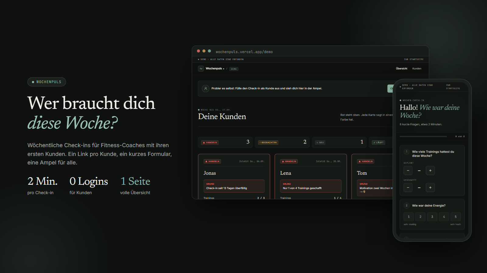
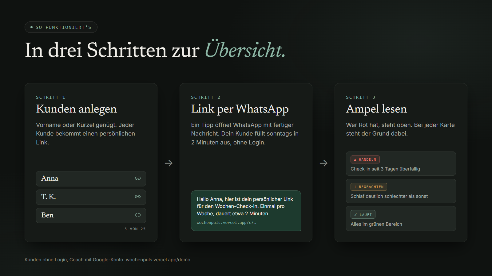
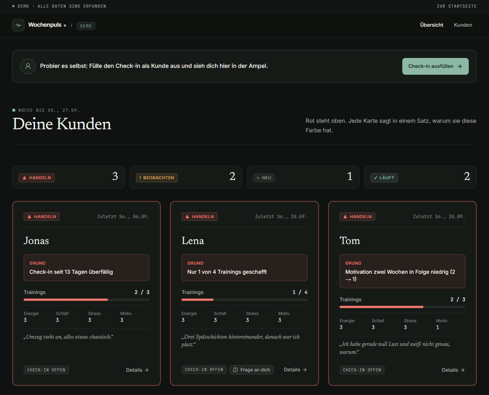
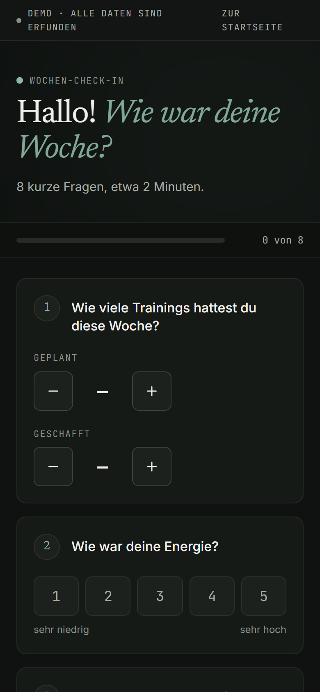
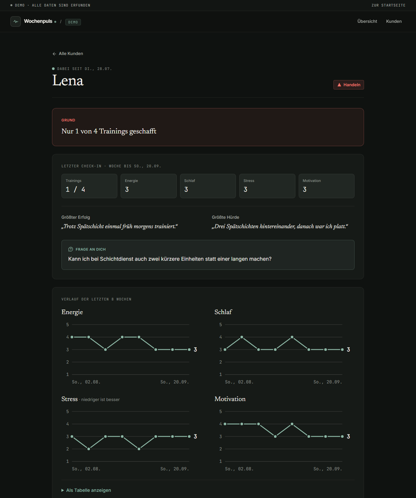
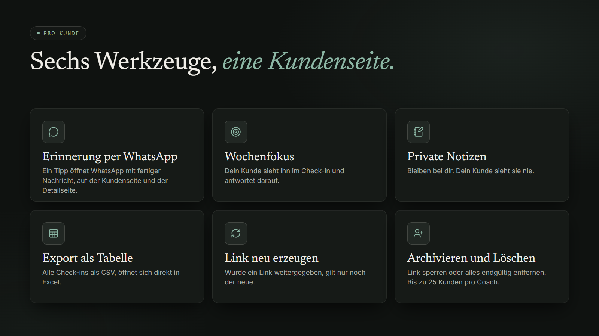
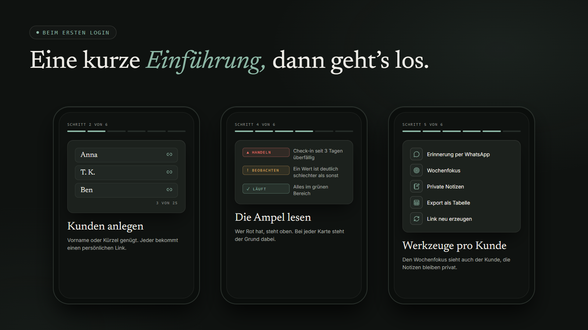

<div align="center">

**Deutsch** · [English](README.en.md)

# Wochenpuls

Wöchentliche Check-ins für Fitness-Coaches mit ihren ersten Kunden. Ein Link pro Kunde, ein kurzes Formular, eine Ampel für alle.



[](https://wochenpuls.vercel.app/demo)
[](LICENSE)


[Ausprobieren](#ausprobieren) · [Werkzeuge](#werkzeuge-pro-kunde) · [Datenschutz](#datenschutz--grenzen) · [Selbst betreiben](#selbst-betreiben)

</div>

---

## Für wen ist das?

Du bist Fitness-Coach, hast deine ersten Kunden (bis zu 25 sind möglich) und willst wissen, wie es ihnen wirklich geht, ohne jede Woche zehn WhatsApp-Chats durchzuscrollen oder eine Tabelle zu pflegen, die keiner mehr aktuell hält.

Wochenpuls sammelt die wöchentliche Rückmeldung deiner Kunden an einem ruhigen Ort und zeigt dir mit einer Ampel, wer gerade abrutscht. Kein Login für deine Kunden, keine App zum Installieren, nur ein persönlicher Link.

## So funktioniert’s



**1. Kunden anlegen.** Vorname oder Kürzel genügt. Jeder Kunde bekommt einen persönlichen Link.

**2. Link per WhatsApp.** Ein Tipp öffnet WhatsApp mit fertiger Nachricht. Dein Kunde füllt sonntags in etwa zwei Minuten acht kurze Fragen aus: wie viele Trainings er hatte, wie es ihm ging, was gut lief, was schwer war und ob er eine Frage an dich hat.

**3. Eine Seite für alle.** Du siehst auf einen Blick, wer Rot, Gelb oder Grün hat, und in einem Satz, warum. Rot steht immer oben.

## Ausprobieren

Die Demo läuft mit frei erfundenen Kunden, ganz ohne Anmeldung: **[wochenpuls.vercel.app/demo](https://wochenpuls.vercel.app/demo)**

Du kannst selbst mitmachen: Füll den Check-in aus wie ein Kunde und sieh dich danach mit deiner eigenen Ampel in der Übersicht wieder. Die [Einführung für neue Coaches](https://wochenpuls.vercel.app/demo/willkommen) kannst du dort ebenfalls durchklicken.

**Eigenes Konto:** Wochenpuls ist kostenlos und ein Portfolio-Projekt. Du meldest dich mit Google an. Neue Coaches brauchen einen Einladungscode; den vergebe ich persönlich, schreib mir einfach auf [LinkedIn](https://www.linkedin.com/in/schmidt-frederik).

## Die Ampel

Jeder Kunde hat immer eine von vier Ampelfarben. Wochenpuls berechnet sie bei jedem Öffnen der Übersicht neu, nach festen Regeln statt nach Bauchgefühl (`src/lib/ampel.ts`):

| Ampel | Bedeutung | Wann sie erscheint |
|---|---|---|
| 🔴 **Handeln** | Kritisch, jetzt melden | Der Check-in ist seit 3 Tagen oder länger überfällig · **oder** dein Kunde hat weniger als die Hälfte der geplanten Trainings geschafft · **oder** Energie oder Motivation waren zwei Wochen in Folge sehr niedrig (2 von 5 oder weniger) |
| 🟡 **Beobachten** | Warnsignal, im Blick behalten | Der Check-in ist seit 1–2 Tagen überfällig · **oder** ein Wert ist mindestens 2 Punkte schlechter als der eigene Schnitt der zwei bis drei Check-ins davor (bei Stress: höher) · **oder** Energie, Schlaf oder Motivation sind diese Woche sehr niedrig (2 von 5 oder weniger) · **oder** Stress ist diese Woche sehr hoch (5 von 5) |
| ⚪ **Neu** | Frisch angelegt | Der Kunde wartet noch auf seinen ersten Check-in (und ist noch nicht überfällig) |
| 🟢 **Läuft** | Stabil, kein Eingriff nötig | Keine der obigen Bedingungen trifft zu |

Fällig ist der Check-in immer **sonntags**. Fehlt er am Montag noch, springt die Ampel auf Gelb, ab Mittwoch auf Rot. Nachreichen geht bis einschließlich Mittwoch: Dann zählt der Check-in ganz normal für die vergangene Woche. Ein neuer Kunde muss frühestens drei Tage nach dem Anlegen zum ersten Mal einchecken.

## So sieht es aus

**Deine Übersicht.** Alle Kunden auf einer Seite, sortiert nach Dringlichkeit.



<table>
  <tr>
    <td align="center" width="50%">
      <br />
      <sub><b>Der Check-in am Handy.</b> Große Tipp-Knöpfe, etwa zwei Minuten.</sub>
    </td>
    <td align="center" width="50%">
      <br />
      <sub><b>Die Detailseite eines Kunden.</b> Mit Verlauf der letzten Wochen.</sub>
    </td>
  </tr>
</table>

## Werkzeuge pro Kunde



- **Erinnerung per WhatsApp** – auf der Kundenseite und auf der Detailseite. WhatsApp öffnet sich mit fertiger Nachricht, den Empfänger wählst du dort.
- **Wochenfokus** – ein Satz, was diese Woche zählt. Dein Kunde sieht ihn im Check-in und antwortet darauf. Eine neue Fassung gilt ab der nächsten Check-in-Woche.
- **Private Notizen** – nur für dich.
- **Export als Tabelle** – alle Check-ins eines Kunden als CSV, öffnet sich direkt in Excel.
- **Link neu erzeugen** – falls ein Kunden-Link weitergegeben wurde; der alte Link gilt dann nicht mehr.
- **Archivieren und Löschen** – archivierte Kunden sind gesperrt, gelöschte verschwinden samt aller Check-ins. Höchstens 25 Kunden pro Coach.

### Einführung beim ersten Login

Neue Coaches bekommen beim ersten Login eine kurze Einführung in sechs Schritten. In der Demo findest du sie unter [/demo/willkommen](https://wochenpuls.vercel.app/demo/willkommen).



## Datenschutz & Grenzen

Wochenpuls ist bewusst schmal gehalten:

- **Keine Körper- oder Gesundheitsangaben.** Gewicht, Fotos, Ernährung oder Verletzungen werden nicht abgefragt, nur Trainings, vier Einschätzungen von 1 bis 5 (Energie, Schlaf, Stress, Motivation) und kurze Texte. Im Formular steht ausdrücklich: „Bitte keine Gesundheitsangaben wie Verletzungen oder Diagnosen.“
- **Einwilligung der Kunden.** Vor dem ersten Check-in willigt dein Kunde ein und kann das jederzeit widerrufen.
- **Vertrag zur Auftragsverarbeitung.** Coaches schließen ihn bei der Registrierung ab: [/avv](https://wochenpuls.vercel.app/avv). Die [Datenschutzerklärung](https://wochenpuls.vercel.app/datenschutz) kannst du an deine Kunden weitergeben.
- **Kein Konto für Kunden.** Der persönliche Link reicht.
- **Keine Tracker.** Keine Analyse- oder Werbe-Skripte. Es gibt genau ein Cookie, das Sitzungs-Cookie des Coaches nach der Anmeldung.
- **Datenbank nur vom Server aus.** Der Browser greift nie direkt auf die Datenbank zu.
- **Serverstandort Frankfurt.** Server bei Vercel (Region `fra1`), Datenbank bei Firestore (europe-west3).
- **Jeder Coach sieht nur seine eigenen Kunden.**
- **Konto selbst löschen.** Unter „Konto“ löschst du dein Konto samt allen Kunden, Check-ins, Notizen und Einwilligungen.

Was es (noch) nicht gibt: Erinnerungen, die automatisch an Kunden gehen, und eine automatische Zusammenfassung der Woche.

## Selbst betreiben

Wochenpuls ist Open Source (MIT-Lizenz), du kannst es dir selbst aufsetzen. Für ein paar Kunden reichen meist die kostenlosen Tarife von Vercel und Firebase; prüf aber deren Bedingungen, der kostenlose Tarif von Vercel ist zum Beispiel nur für private, nicht-kommerzielle Nutzung gedacht. Etwas technisches Grundverständnis hilft.

> **Wichtig:** Die Datenschutzerklärung und der Vertrag zur Auftragsverarbeitung in diesem Repository nennen mich als Betreiber. Wer Wochenpuls selbst betreibt, braucht eigene Rechtstexte.

1. **Repository forken**: auf GitHub oben rechts auf „Fork“ klicken.
2. **Firebase-Projekt anlegen** (Google Analytics kannst du ausschalten) und darin eine Firestore-Datenbank erstellen: Region **europe-west3 (Frankfurt)**, Modus „Produktion“, Datenbank-ID `(default)`. Die Region lässt sich später nicht mehr ändern.
3. **Dienstkonto-Schlüssel erzeugen**: In den Firebase-Projekteinstellungen unter „Dienstkonten“ auf „Neuen privaten Schlüssel generieren“ klicken. Das lädt eine JSON-Datei herunter, deren gesamter Inhalt später in eine Umgebungsvariable kommt. **Diese Datei ist geheim und darf niemals auf GitHub landen.**
4. **Anmeldung einrichten**: In Firebase unter „Authentication“ → „Anmeldemethode“ den Anbieter **Google** aktivieren. Deine eigene Domain trägst du unter „Einstellungen“ → „Autorisierte Domains“ ein.
5. **Bei Vercel importieren**: dein geforktes Repository als neues Projekt importieren und dabei diese Umgebungsvariablen setzen:
   - `FIREBASE_SERVICE_ACCOUNT` – der komplette Inhalt der JSON-Datei aus Schritt 3
   - `NEXT_PUBLIC_FIREBASE_API_KEY`, `NEXT_PUBLIC_FIREBASE_AUTH_DOMAIN`, `NEXT_PUBLIC_FIREBASE_PROJECT_ID` – aus den Firebase-Projekteinstellungen unter „Meine Apps“ → Web-App (die Werte `apiKey`, `authDomain`, `projectId`). Sie sind nicht geheim.
   - `ADMIN_EMAIL` – deine Google-Adresse. Wer sich damit anmeldet, braucht keinen Code und kann unter „Codes“ Einladungscodes für weitere Coaches erzeugen.

   Setzt du die Variablen erst nachträglich, lös in Vercel danach einmal „Redeploy“ aus.
6. **Prüfen**: `https://deine-adresse.vercel.app/status` öffnen. Alle drei Zeilen müssen „✓ Ja“ zeigen.
7. **Loslegen**: unter `/login` mit der Admin-Adresse anmelden und unter „Kunden“ den ersten Kunden anlegen.

Die Node-Version in Vercel muss zu `package.json` passen (`engines`: 24.x). Ab dann baut Vercel bei jedem Push automatisch neu.

## FAQ

**Brauchen meine Kunden eine App?**
Nein. Sie öffnen ihren persönlichen Link im Browser, wie eine ganz normale Webseite.

**Was, wenn ein Kunde den Check-in mal vergisst?**
Dann springt seine Ampel automatisch auf Gelb und später auf Rot. Reicht er ihn bis Mittwoch nach dem fälligen Sonntag nach, zählt er trotzdem für diese Woche. Mit einem Tipp erinnerst du ihn per WhatsApp.

**Kann ich das für mehrere Coaches nutzen?**
Ja. Jeder Coach meldet sich mit seinem eigenen Google-Konto an und sieht nur seine eigenen Kunden. Neue Coaches brauchen beim ersten Mal einen Einladungscode.

**Wie bekomme ich einen Einladungscode?**
Schreib mir auf [LinkedIn](https://www.linkedin.com/in/schmidt-frederik). Wochenpuls ist kostenlos.

**Ist das eine fertige, kommerzielle App?**
Nein, es ist ein Portfolio-Projekt: klein, sauber und frei nutzbar.

**Wo liegen die Daten?**
In Frankfurt: der Server bei Vercel (`fra1`), die Datenbank bei Firestore (europe-west3).

## Lizenz

MIT, siehe [LICENSE](LICENSE).

Entwickelt von [Frederik Schmidt](https://github.com/fxd-gif).

---

English version: [README.en.md](README.en.md)

---

<details>
<summary><strong>Für Entwickler:innen</strong></summary>

### Tech-Stack

- [Next.js](https://nextjs.org/) 16 (App Router), React 19, TypeScript
- Tailwind CSS 4
- Firebase Authentication (Google) und Firestore, Datenzugriff nur serverseitig über das Admin SDK
- Vitest für Tests
- Hosting auf Vercel, Region `fra1` (Frankfurt)

Ampel-Regeln: `src/lib/ampel.ts`. Datums- und Wochenrechnung (immer Europe/Berlin): `src/lib/woche.ts`.

### Lokal starten

Voraussetzung: Node.js 24.x.

```bash
npm install
npm run dev
```

Dann [http://localhost:3000](http://localhost:3000) öffnen. Für die volle Coach-Ansicht mit Datenbank werden die Umgebungsvariablen aus dem Abschnitt „Selbst betreiben“ benötigt (`FIREBASE_SERVICE_ACCOUNT`, die drei `NEXT_PUBLIC_FIREBASE_…`-Werte und `ADMIN_EMAIL`). Lokal gehören sie in eine Datei `.env.local`, die Git ignoriert. Ohne sie funktioniert die Demo unter `/demo` trotzdem vollständig.

### Tests

```bash
npm test
```

Aktuell laufen 34 Tests (Ampel, Wochenrechnung, Übersicht, CSV-Export, WhatsApp-Link).

</details>
